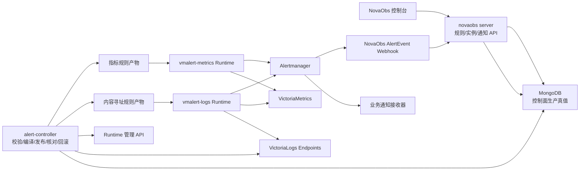
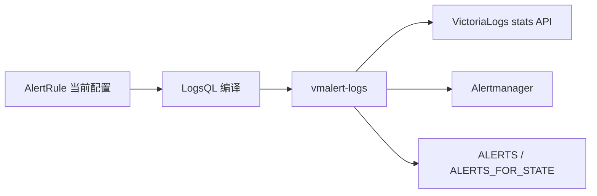
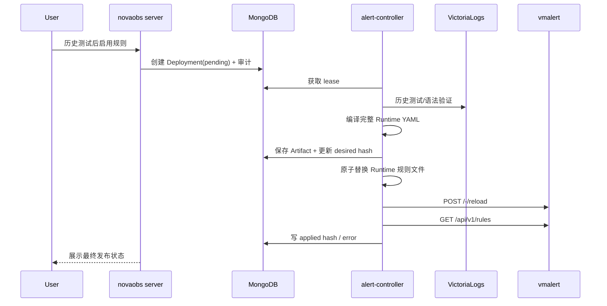

# NovaObs 日志告警一期生产化 Handoff 架构设计

> 日期：2026-06-22  
> 状态：下一阶段实施基线  
> 范围：NovaObs 告警中心、查询式日志规则、日志派生指标、vmalert Runtime、Alertmanager 通知闭环  
> 明确延期：流式日志告警、严格连续事件匹配、Kafka 状态计算进入二期

## 0. 架构决策摘要

下一阶段按以下结论实施，不再继续扩展当前只有列表和创建能力的 `AlertRule` 占位模型：

1. **不引入 Flink，不自研日志规则执行引擎。**一期只实现查询式日志告警，执行器采用社区版 vmalert。
2. **规则管理集中在 NovaObs。**MongoDB 保存当前规则、更新记录、Deployment、Runtime 期望状态、通知策略和审计，是唯一控制面生产真值；产品不引入草稿态，也不突出“版本”概念。
3. **新增部署进程，但不新建代码仓库。**在现有 `novaobs` Go Module 中新增 `cmd/alert-controller`；HTTP API 继续由 `cmd/server` 承载。
4. **vmalert 是外部 Runtime，不是 NovaObs 业务服务。**NovaObs 负责生成、发布、核对和回滚规则产物，vmalert 只负责周期查询、计算、状态机和向 Alertmanager 发送告警。
5. **独立 VictoriaLogs Endpoint 默认对应独立日志 Runtime。**同一 Endpoint 下的多个业务和 VictoriaLogs 租户共享 Runtime；不按业务、不按规则启动 vmalert。
6. **日志和指标使用独立 vmalert Runtime。**`vmalert-logs` 查询 VictoriaLogs；`vmalert-metrics` 查询 VictoriaMetrics。不要让一个进程同时承担两类故障域。
7. **一期同时支持直接日志告警和日志派生指标。**直接告警是默认正确性路径；派生指标用于趋势、复用和后续 Metrics 告警，不能把高基数原样搬进 VictoriaMetrics。
8. **通知与规则解耦。**规则引用 `notification_policy_id`，不再把自由文本 `alert_route` 当生产通知配置。
9. **一期完成查询式日志告警闭环。**包括规则、历史测试、直接启用、更新记录/回退、实例、事件、通知关联、Runtime 调和、IAM 和审计；静默与流式能力后续迭代。
10. **二期只承接流式能力。**严格连续 X 次、事件顺序、非匹配清零、秒级逐事件告警和 Kafka 状态计算不进入一期。

## 1. 当前工程事实与问题

### 1.1 已有基础

- Logs 已形成 `服务 -> 日志路由 -> LogEndpoint -> VictoriaLogs / VMUI Explore` 路径。
- `LogEndpoint` 已保存查询 URL、租户 `AccountID / ProjectID` 和作用域，可作为规则绑定的数据源真值。
- `internal/alerting` 已有 MongoDB Store、规则列表和创建接口。
- 前端已有 `/logs/alerts` 日志域入口和 `/alerts` 告警中心入口。
- `tools/vmalert-local` 已验证以下本地链路可运行：

```text
VictoriaLogs -> vmalert -> Alertmanager
                    |
                    -> VictoriaMetrics
```

- 已验证 LogsQL `stats` 结果能够触发 vmalert 告警，`ALERTS` 状态可以 remote write 到 VictoriaMetrics。

### 1.2 当前告警实现不能继续沿用的部分

当前 `internal/alerting.Rule` 同时保存规则输入和状态，但服务层只实现 `List/Create`，HTTP 层只有：

```text
GET  /api/v1/alert-rules
POST /api/v1/alert-rules
```

缺失：

- 服务、日志路由、LogEndpoint 和 VictoriaLogs 租户绑定。
- 当前规则生产真值与不可变更新记录边界。
- 查询测试、基数预估和发布校验。
- 生成的 vmalert 产物、hash 和生效状态。
- Runtime 管理、重载、回读和回滚。
- 告警实例、历史事件和恢复状态。
- 通知策略、接收器、静默和抑制。
- IAM 权限、发布审计和高风险操作记录。
- Runtime 自身健康和规则评估 SLO。

当前 `AlertRoute string`、`Condition string`、`GroupBy string` 不能作为最终生产模型保留。它们必须被结构化模型和引用关系替代，旧字段消费逻辑同步删除。

## 2. 一期目标与非目标

### 2.1 一期生产目标

业务用户可以完成以下闭环：

```text
选择服务/日志路由
-> 编写或从 Explore 带入查询
-> 设置窗口、次数阈值和分组
-> 用历史日志测试
-> 查看实例数与查询成本
-> 测试并启用
-> vmalert 生效
-> Alertmanager 通知
-> 告警中心查看 Firing/Resolved
-> 禁用或从更新记录回退
-> 审计可追溯
```

一期支持的业务规则：

1. 窗口内出现一次指定字符串或结构化条件即告警。
2. 窗口内匹配次数大于等于 X 即告警。
3. 可按受控字段分组生成多个告警实例。
4. 可把匹配计数或速率生成 VictoriaMetrics 派生指标。
5. 支持 `for`、`keep_firing_for`、评估延迟和查询错误状态。

一期派生指标只生成 `rule_id + service_id + 受控静态标签` 的规则级聚合，不继承告警 `group_by` 字段；这是防止 request ID、Pod UID 等高基数被搬进时序库的硬约束。

### 2.2 一期明确不做

- 不实现严格“连续 X 条都匹配，中间不匹配则清零”。
- 不保证逐事件亚秒或秒级触发。
- 不引入 Kafka Streams、Flink CEP、ksqlDB 或其他状态流处理 Runtime。
- 不实现机器学习异常检测、动态基线和日志聚类告警。
- 不允许用户直接编辑完整 vmalert YAML 或 Alertmanager YAML。
- 不允许任意日志字段作为指标 label 或告警 group by。
- 不把 VMUI iframe 内部状态当 NovaObs 可读取的查询真值。

## 3. 目标架构



### 3.1 控制面与数据面边界

| 组件 | 负责 | 不负责 |
| --- | --- | --- |
| `novaobs server` | 用户 API、IAM、规则真值、查询测试、实例/事件查询、内部规则产物读取 | 不周期执行 LogsQL，不直接维护告警状态机 |
| `alert-controller` | Deployment 调和、规则编译、产物发布、vmalert/Alertmanager 重载、回读、回滚、Runtime 健康同步 | 不处理业务 HTTP 请求，不承载日志流量 |
| `vmalert-logs` | 执行 LogsQL 告警/recording rules、维护 Pending/Firing 状态、remote write | 不保存规则业务真值，不提供用户 CRUD |
| `vmalert-metrics` | 执行 MetricsQL/PromQL 规则 | 不查询 VictoriaLogs |
| Alertmanager | 去重、分组、抑制、静默、通知投递 | 不作为规则和告警历史生产真值 |
| VictoriaMetrics | 派生指标、`ALERTS`、`ALERTS_FOR_STATE`、规则运行历史 | 不保存规则草稿和发布审批 |
| MongoDB | 当前规则、更新记录、Deployment、通知策略、告警事件、审计 | 不承载高频时序样本 |

## 4. 工程与部署取舍

### 4.1 不新建仓库

在现有 `novaobs` 仓库增加：

```text
cmd/
  server/
  alert-controller/

internal/alerting/
  model.go
  repository.go
  service.go
  validation.go
  compiler.go
  cardinality.go
  event.go

internal/alertruntime/
  model.go
  repository.go
  reconciler.go
  artifact.go
  vmalert_client.go
  alertmanager_client.go
```

`cmd/server` 和 `cmd/alert-controller` 是两个独立二进制和部署单元，但共享领域模型、Repository、RBAC、审计和配置。

### 4.2 为什么 controller 必须独立

- HTTP Server 重启或扩缩容不能中断发布调和。
- 发布失败需要带 lease 的重试、退避和幂等。
- 同一 Deployment 只能由一个 controller 执行。
- 后续增加多个 Runtime、分片和灰度时无需改 API 进程。
- controller 可以独立设置网络权限，只允许访问 VictoriaLogs、vmalert、Alertmanager 和内部产物接口。

一期不引入新的消息队列。MongoDB 中的 Deployment 记录兼作可靠工作队列，controller 使用 `lease_owner / lease_expires_at` 抢占待处理任务。

## 5. 领域生产真值

### 5.1 AlertRule

保存稳定业务身份，不保存可变执行状态：

```text
id
name
signal_type = logs
service_id
log_route_id
log_endpoint_id
owner_team
severity
notification_policy_id
enabled
current_update_id / applied_update_id
created_by / created_at
updated_by / updated_at
```

约束：

- `service_id + name` 唯一。
- `log_route_id` 必须属于 `service_id`。
- `log_endpoint_id` 必须来自该路由当前绑定的 Endpoint。
- Endpoint 变化不会静默修改规则，必须形成一条更新记录并重新调和。

### 5.2 AlertRuleUpdateRecord

前端只称“更新记录”，用于审计和回退，不在主流程突出版本号：

```text
id
rule_id
parent_update_id
query_spec
evaluation_spec
grouping_spec
derived_metric_spec
annotations
input_hash
created_by / created_at
```

一期结构化规则输入：

```text
QuerySpec
  query_language = logsql
  filter_expression
  match_mode = contains | exact | logsql

EvaluationSpec
  aggregation = count | rate
  operator = gt | gte
  threshold
  window
  evaluation_interval
  evaluation_delay
  pending_for
  keep_firing_for

GroupingSpec
  fields[]
  max_instances

DerivedMetricSpec
  enabled
  signal = match_count | match_rate
  retention_class
```

即使前端提供“字符串包含”的简单模式，后端也必须保存编译后的规范化 LogsQL 和原始用户输入，便于审计与重放。

### 5.3 AlertRuleDeployment

表示某次规则更新向某 Runtime 的一次后台调和：

```text
id
rule_id
update_id
runtime_id
desired_artifact_hash
applied_artifact_hash
status = pending | validating | publishing | applied | failed | rolled_back
attempts
lease_owner / lease_expires_at
validation_summary
runtime_message
audit_id
created_at / updated_at
```

### 5.4 AlertRuntime

表示一个逻辑规则执行故障域：

```text
id
kind = vmalert_logs | vmalert_metrics | alertmanager
region
environment
log_endpoint_id
datasource_url_ref
remote_write_url_ref
notifier_url_ref
rule_delivery = configmap
configmap_namespace
configmap_name
desired_artifact_hash
applied_artifact_hash
health
last_seen_at
last_error
```

敏感 URL、token、Basic Auth、TLS 私钥只能保存 `secret_ref`，不得直接进入 Runtime 文档、规则 YAML、日志或审计详情。

### 5.5 RuleArtifact

编译产物是派生数据，不是用户规则真值：

```text
id
runtime_id
content_hash
format = vmalert_yaml | alertmanager_yaml
content
source_versions[]
validation_status
created_at
```

一期由 `alert-controller` 把完整 Runtime Artifact 原子替换到 vmalert 挂载的共享规则目录：

```text
/etc/vmalert/rules/runtime.yaml
```

vmalert 配置 `-configCheckInterval` 作为自愈，controller 在 ConfigMap 更新后主动调用 `/-/reload`。本地开发使用普通文件挂载。

虽然 vmalert 支持通过 HTTP URL 拉取规则，但一期生产不把 NovaObs API 可用性和规则源鉴权能力变成 Runtime 重启依赖。后续如改为 HTTP pull，必须先解决独立服务身份、TLS、缓存和控制面不可用时的最后成功版本恢复。

### 5.6 AlertInstance 与 AlertEvent

`AlertInstance` 保存当前投影；`AlertEvent` 保存不可变状态变化历史：

```text
AlertInstance
  fingerprint
  rule_id
  group_labels
  state = pending | firing | resolved
  value
  starts_at / ends_at
  last_evaluated_at
  last_event_id

AlertEvent
  event_id
  fingerprint
  previous_state / state
  value
  labels / annotations
  source_runtime_id
  occurred_at / received_at
```

查询是否成功属于规则运行健康，不伪装成业务告警实例：

```text
RuleEvaluationHealth
  rule_id / runtime_id
  health = ok | no_data | error
  last_evaluated_at
  evaluation_duration_ms
  last_error
```

对一期正向匹配规则，`no_data` 表示窗口内没有匹配结果，业务状态等价于正常；数据源错误或超时记录为 `error`，不能被当成业务恢复。告警无数据检测不在一期规则类型范围内。

`fingerprint` 只由 `rule_id + 稳定 group labels` 生成。日志正文、`$value`、trace ID、request ID 和动态异常消息不得进入实例标签。

Alertmanager Webhook 写入必须幂等，`event_id` 或状态转换唯一键重复时不得产生重复历史。

### 5.7 NotificationPolicy 与 Receiver

```text
NotificationPolicy
  id
  name
  service_id（可空，空表示全局）
  alertmanager_receiver
  enabled
```

一期只管理业务规则到 Alertmanager receiver 稳定标识的关联，不在 NovaObs 保存第三方 Webhook URL 或凭据，也不暴露尚未由平台下发的分组时间伪配置。企业 IM、电话、短信继续由 Alertmanager 或现有通知平台承接。

Alertmanager 配置必须为策略登记的 `alertmanager_receiver` 建立同名 receiver；controller 在规则产物中解析并写入 `notification_receiver` 标签，Alertmanager 按该标签路由。receiver 标识创建后不可修改，需要换路由时新建策略并更新规则。NovaObs AlertEvent Webhook 作为平台固定 receiver，启用 `send_resolved: true`；业务接收器使用路由 `continue` 语义，确保所有 Firing/Resolved 变化都进入告警中心。Alertmanager 配置托管进入后续迭代，不能在一期模型中假装已经由 NovaObs 下发。

## 6. 规则执行路径

### 6.1 默认路径：直接查询告警



示例编译产物：

```yaml
groups:
  - name: logs-endpoint-01-30s
    type: vlogs
    interval: 30s
    eval_delay: 5s
    limit: 100
    labels:
      novaobs_runtime_id: logs-endpoint-01
    headers:
      - "AccountID: 1001"
      - "ProjectID: 2001"
    rules:
      - alert: NovaObsLogRule
        expr: '_time:1m AND service.name:="payment-service" AND "payment failed" | stats by (service.name) count() as matches | filter matches:>=3'
        for: 0s
        keep_firing_for: 30s
        labels:
          novaobs_rule_id: rule-123
          service_id: payment-service
          severity: critical
          signal_type: logs
        annotations:
          summary: payment-service 日志匹配次数超过阈值
```

默认使用直接告警，因为它：

- 少一次 recording -> metrics -> alert 的评估延迟。
- 无匹配时自然返回空结果并恢复，不会读取陈旧派生指标。
- 对一期“出现一次”和“窗口内 X 次”语义最直接。

### 6.2 派生指标路径

开启 `derived_metric_spec.enabled` 时，`vmalert-logs` 同时生成 recording rule：

```text
VictoriaLogs
-> LogsQL stats
-> novaobs_log_rule_value
-> VictoriaMetrics
```

派生指标统一命名：

```text
novaobs_log_rule_value{
  rule_id,
  service_id,
  environment,
  signal,
  <允许的 group labels>
}
```

不把更新序号放进 label，避免每次更新制造新时间序列。更新记录与产物 hash 通过控制面追踪。

派生指标一期用途：

- 告警详情趋势图。
- Dashboard 复用。
- 查询成本较高的日志聚合预计算。
- 为后续 Metrics 规则提供输入。

派生指标告警必须增加新鲜度保护，避免无新样本时旧值继续触发：

```promql
last_over_time(novaobs_log_rule_value{rule_id="rule-123"}[2m]) >= 3
and
time() - timestamp(novaobs_log_rule_value{rule_id="rule-123"}) < 60
```

一期默认仍由直接 LogsQL 规则负责告警正确性。只有通过零值/新鲜度测试的派生指标，才允许切换为 `vmalert-metrics` 告警源。

## 7. 窗口语义

规则必须区分以下参数，禁止继续使用一个模糊的 `window` 字符串表达全部行为：

| 参数 | 语义 | 一期默认 |
| --- | --- | --- |
| `window` | 每次查询覆盖的日志时间范围 | `1m` |
| `evaluation_interval` | 多久执行一次 | `30s` |
| `evaluation_delay` | 评估时间向后偏移，容纳摄入延迟 | `5s` |
| `pending_for` | 条件持续多久才进入 Firing | `0s` |
| `keep_firing_for` | 条件消失后保持 Firing 多久 | `30s` |

平台限制：

- `evaluation_interval` 最小 `15s`。
- `window` 必须大于等于 `evaluation_interval`。
- 默认 `evaluation_interval <= window / 2`，减少窗口边界漏检风险。
- 一期 `window` 最大 `1h`；更长窗口应使用派生指标。
- 查询超时默认 `10s`，超时进入规则 `error`，不能被当成正常恢复。
- “连续 X 次”在一期产品文案中统一写成“窗口内匹配 X 次”，不得误导为事件连续性。

## 8. 高基数治理

日志转指标不是消除高基数，而是把基数转移到时序库。发布前必须执行准入检查。

### 8.1 默认允许分组字段

```text
service.id / service.name
deployment.environment
region
cluster.id
k8s.namespace.name
level
error_code / error_type（已治理字段）
```

### 8.2 默认禁止分组字段

```text
trace_id / span_id / request_id
user_id / order_id / session_id
k8s.pod.uid
完整 URL
日志正文
堆栈和动态异常消息
未登记的 detected field
```

### 8.3 后台安全保护

主流程只呈现“测试规则”和“启用告警”。`POST /alerts/rules/test` 返回：

```text
matched_log_count
estimated_instance_count
top_groups
query_duration_ms
scanned_bytes（数据源支持时）
partial_response
warnings / errors
```

一期限制：

- `group_by` 最多 3 个字段。
- 每条规则默认最多产生 100 个实例，编译到 vmalert group `limit`。
- 超过限制直接拒绝启用，但不额外设计审批或发布门禁页面。
- 用户只能选择字段目录中标记为 `alert_groupable` 的字段。

## 9. 多 VictoriaLogs Runtime 规划

### 9.1 默认映射

```text
LogEndpoint + Region + Environment
                |
                v
        一个逻辑 vmalert-logs Runtime
                |
                +-- 多个业务
                +-- 多个 AccountID / ProjectID 租户
```

同一 VictoriaLogs Endpoint 下通过 rule group `headers` 指定 `AccountID / ProjectID`。独立 Endpoint 不默认共用一个 vmalert，因为 vmalert 进程只有一个 `-datasource.url`。

一期不通过 vmauth 把多个独立 Endpoint 强行汇聚到一个 Runtime。这样可以保持：

- 数据源故障隔离。
- 查询容量隔离。
- 认证和租户边界清晰。
- Runtime 健康能够准确归因到 Endpoint。

### 9.2 HA 与扩容

- 生产逻辑 Runtime 至少运行 2 个 vmalert 副本。
- 两个副本执行相同规则并向 Alertmanager 发送相同稳定标签，由 Alertmanager 去重。
- 不把 replica 作为告警实例 label；副本身份只通过抓取目标标签观测。
- `remoteWrite / remoteRead` 指向同一 VictoriaMetrics，持久化 `ALERTS_FOR_STATE`。
- 规则量和评估耗时达到容量门限后，由 controller 按 rule group 做确定性分片，而不是临时在 vmalert 内随机拆分。
- 一期先以压测结果确定单 Runtime 规则上限，不在代码中写未经验证的固定容量数字。

## 10. 规则发布与回滚

### 10.1 发布流程



### 10.2 原子性要求

- 每次发布生成完整 Runtime 产物，不能把单条规则直接追加到共享文件。
- 保存按内容 hash 标识的 Artifact，并原子替换 Runtime 规则文件。
- Runtime 只挂载 controller 管理的规则目录。
- controller 主动 reload，同时保留 `configCheckInterval` 作为自愈。
- reload 后必须回读 `/api/v1/rules`，按 `novaobs_rule_id` 核对。
- 不能因为 HTTP reload 返回 200 就标记发布成功。
- 发布失败保留失败状态并退避重试；文件原子替换确保不会出现半份配置。

### 10.3 热加载状态边界

vmalert 热加载不会触发 remote read 状态恢复。以下修改视为新告警身份或需要显式重置：

- group by 字段变化。
- 稳定标签变化。
- 数据源/租户变化。
- 规则从直接查询切换到派生指标执行。

仅修改 annotations 不应制造新实例。平台发布预览必须显示是否会重置 Pending/Firing 状态。

## 11. API 设计

用户 API 均挂在受平台 SessionMiddleware 保护的 `/api/v1`：

```text
GET    /alerts/rules
POST   /alerts/rules/test
POST   /alerts/rules
GET    /alerts/rules/{id}
PUT    /alerts/rules/{id}
POST   /alerts/rules/{id}/disable
GET    /alerts/rules/{id}/updates
POST   /alerts/rules/{id}/rollback
GET    /alerts/rules/{id}/deployments

GET    /alerts/instances
GET    /alerts/events

GET    /alerts/notification-policies
POST   /alerts/notification-policies
PUT    /alerts/notification-policies/{id}
```

Alertmanager 使用独立 Bearer Token 调用：

```text
POST /api/v1/alerts/webhook/alertmanager
```

创建、更新、停用和回退都会产生 Deployment 与审计；用户不需要理解单独的“发布”动作。

## 12. IAM、权限与审计

使用平台统一 subject，不创建告警模块用户体系。

权限：

```text
alerts.rule:read
alerts.rule:manage
alerts.rule:publish
alerts.instance:read
alerts.silence:manage
alerts.notification:read
alerts.notification:manage
alerts.runtime:read
alerts.runtime:manage
```

作用域优先：

```text
Global
Environment
ServiceID
```

必须审计：

- 创建/修改规则当前配置并追加不可变更新记录。
- 发布、禁用、回滚。
- 管理服务范围或全局通知策略。
- 修改通知策略和接收器。
- 修改 Runtime 数据源、remote write、notifier 和密钥引用。

审计只记录 `secret_ref` 和变更摘要，不记录 webhook token、密码或完整 Authorization header。

## 13. 前端信息架构

### 13.1 唯一生产入口

`/alerts` 是告警域生产入口，包含：

```text
告警实例 | 规则 | 通知策略
```

`/logs/alerts` 只是 Logs 上下文视图：

- 默认筛选 `signal_type=logs`。
- 提供“创建日志规则”。
- 展示服务、日志路由、VictoriaLogs Endpoint 和 Runtime 状态。
- 规则详情和实例详情跳转统一告警中心，不维护第二套编辑器和状态真值。

### 13.2 创建规则工作流

```text
1. 范围：服务、日志路由、Endpoint、租户
2. 查询：简单字符串模式或 LogsQL
3. 条件：次数/速率、阈值、分组
4. 稳定性：窗口、评估间隔、延迟、for、keep firing
5. 派生指标：是否生成、标签预算、保留级别
6. 通知：严重级别、责任团队、通知策略、runbook
7. 测试与发布：趋势、样例、实例数、成本、产物 hash
```

页面必须显示真实状态：

- 数据源和 AccountID/ProjectID。
- 最近测试窗口和查询耗时。
- 当前 published version、desired/applied hash。
- vmalert Runtime health 和最后评估错误。
- 操作 actor、audit id 和回退来源更新记录。

## 14. 可靠性、安全与可观测性

### 14.1 生产可用要求

- `novaobs server`、`alert-controller`、vmalert、Alertmanager 均多副本部署。
- controller 使用 Mongo lease 保证同一 Deployment 单执行者。
- 所有外部调用有 timeout、指数退避和最大重试次数。
- 查询错误与无匹配严格区分；错误不能触发自动恢复。
- Runtime 加载失败继续保留最后一个成功产物。
- Alertmanager Webhook 和通知投递按至少一次处理，NovaObs Event API 幂等。
- 规则、通知和 Runtime 的所有敏感信息使用平台 Secret Store。
- 内部规则产物接口不得匿名暴露。

### 14.2 自监控指标

至少采集：

```text
规则总数、启用数、Pending/Firing 实例数
Deployment pending/applied/failed 数和持续时间
desired/applied hash 不一致数量
规则评估耗时、失败次数、超时次数、漏评估次数
单规则结果数和 limit exceeded 次数
VictoriaLogs 查询 QPS、错误率、partial response
remote write queue、失败和重试
Alertmanager 通知成功率、失败率、队列延迟
AlertEvent webhook 接收延迟和去重数
controller lease、调和循环和失败重试
```

### 14.3 一期 SLO

在生产压测和故障演练中验证：

- 已发布规则在一个 `configCheckInterval` 内被 Runtime 发现。
- 正常数据源下，评估延迟不超过 `evaluation_interval + evaluation_delay + 查询耗时`。
- Runtime 发布失败不会覆盖最后成功配置。
- 单副本故障不停止规则评估和通知。
- AlertEvent 重复投递不生成重复实例或重复状态历史。
- 数据源超时显示规则健康 `error`，不误报为业务 `resolved`。

## 15. 数据库索引与保留

建议集合和索引：

```text
alert_rules
  unique(service_id, name)
  index(log_endpoint_id, enabled)

alert_rule_updates
  index(rule_id, created_at desc)

alert_rule_deployments
  index(status, lease_expires_at, created_at)
  index(rule_id, created_at desc)

alert_runtimes
  unique(kind, region, environment, log_endpoint_id)

alert_rule_artifacts
  unique(runtime_id, content_hash)

alert_notification_policies
  unique(service_id, name)

alert_instances
  unique(fingerprint)
  index(state, severity, updated_at desc)

alert_events
  unique(event_id)
  index(fingerprint, occurred_at desc)
  TTL 按平台告警历史保留策略配置
```

规则、更新记录、Deployment 和审计不得设置 TTL。实例是当前投影，可以从事件和 Runtime 重建，但生产接口以 Mongo 当前投影为主。

## 16. 下一步实施计划

### Milestone 1：领域模型与控制面

交付：

- 重构 `internal/alerting`，删除旧 `Rule` 错误字段消费。
- 新增 Rule、UpdateRecord、Deployment、Artifact Repository。
- 接入 IAM/RBAC 和审计。
- 完成规则 CRUD、历史测试、直接启用和回退 API 契约。
- 旧扁平规则缺少服务、日志路由和通知策略，不能伪造默认值迁移；启动时检测到旧文档直接失败，要求先备份、显式清理并按新流程重建，不保留双模型。

验收：

- 未登录 401、无权限 403、有权限成功。
- 更新记录不可变，但 UI 不突出版本概念。
- 启用只能使用短期有效、与当前输入绑定的历史测试凭据。
- Endpoint/服务/路由不一致时拒绝创建和发布。

### Milestone 2：执行 Runtime 与规则发布

交付：

- 新增 `cmd/alert-controller`。
- 实现 vmalert YAML compiler、`-dryRun` validator、Runtime client。
- 实现内容寻址 Artifact、原子文件替换、reload、回读和失败重试。
- 按 LogEndpoint 建立 vmalert-logs Runtime。
- 接入 VictoriaMetrics remote write/read。

验收：

- 创建一条“匹配一次”规则并在 Alertmanager 看到 Firing/Resolved。
- 创建一条“窗口内 X 次”规则并验证分组实例。
- 非法 LogsQL、超基数、Runtime 不可达时发布失败且旧配置不受影响。
- 修改 annotation 不重置实例；修改 group by 明确提示状态重置。

### Milestone 3：派生指标与通知闭环

交付：

- LogsQL recording rule 编译与 `novaobs_log_rule_value` 写入。
- vmalert-metrics Runtime。
- 派生指标新鲜度保护。
- NotificationPolicy 与预配置 Alertmanager receiver 的稳定关联。
- Alertmanager Webhook -> AlertEvent -> AlertInstance。
- Alertmanager 配置托管与静默 API 延后，不在一期伪装成已下发配置。

验收：

- 日志匹配趋势可在 VictoriaMetrics 查询。
- 派生指标停止更新后不会因陈旧值持续误报。
- 通知失败可见、可重试、不会阻塞实例状态入库。
- Alertmanager 重复 webhook 不产生重复事件。

### Milestone 4：前端完整闭环

交付：

- `/alerts` 聚焦实例、状态更新记录、规则和通知策略。
- `/logs/alerts` 日志域筛选视图。
- 创建、测试并启用、更新记录回退工作流。
- 查询趋势、样例日志、分组实例、基数风险和产物 hash 展示。
- 真实权限不足态和 Runtime 错误态。

验收：

- 用户可以从日志路由上下文完成完整发布。
- 页面不依赖 mock 数据，不显示无法由后端提供的指标。
- 前端测试、构建和 Playwright 截图验收通过。

### Milestone 5：生产硬化与上线

交付：

- HA、容量压测、故障注入、备份恢复和运行手册。
- Runtime、controller、通知和内部接口监控告警。
- 规则限额、查询超时、限流和异常租户隔离。
- 灰度服务接入、旧规则对账和迁移。

验收：

- `go test ./...`、前端测试和构建全部通过。
- 核心包覆盖率达到项目要求。
- 完成 vmalert、VictoriaLogs、VictoriaMetrics、Alertmanager 单点故障演练。
- 完成至少一次规则发布失败自动回滚演练。
- 选择真实业务服务进行 shadow 告警对账，确认触发、恢复、通知和审计一致后再切生产通知。

## 17. 一期完成定义

只有同时满足以下条件，日志告警一期才算完成：

- 规则生产真值、更新记录和 Runtime 产物边界清晰，旧占位模型已清理。
- 两类核心日志规则可从创建到通知完整运行。
- 多业务可共享同一 Endpoint Runtime，多独立 Endpoint 正确隔离。
- 规则发布具备校验、预览、发布、核对、失败回滚和审计。
- 告警实例具备 Pending、Firing、Resolved 状态，规则评估具备 NoData/Error 可观测健康状态。
- 日志可生成受基数治理的 VictoriaMetrics 派生指标。
- NotificationPolicy、预配置 receiver 关联和 AlertEvent 历史可用；静默进入后续迭代。
- API、controller、vmalert、Alertmanager 和数据源故障都可诊断。
- IAM、Secret、审计、限流、超时、幂等、备份和运行手册达到生产要求。
- 已完成真实业务 shadow 对账，而不是只通过本地 Docker demo。

## 18. 二期：流式日志告警

二期再引入独立 `stream evaluator` 能力，但必须复用一期控制面模型：

```text
AlertRule / Version / Deployment / Runtime / AlertEvent / NotificationPolicy
```

二期新增：

- `evaluation_engine = stream`。
- Kafka 日志 topic 与稳定 partition key。
- 严格连续 X 次、非匹配清零、max gap。
- event time、乱序、迟到、重复事件和状态恢复语义。
- 流式 Runtime 的 checkpoint、replay、DLQ 和幂等 AlertEvent。

一期不为二期预建通用插件框架。只需要保证 `AlertRuntime.kind` 和编译/发布适配器边界能够增加新的 Runtime 类型。

## 19. 被否决的替代方案

| 方案 | 结论 | 原因 |
| --- | --- | --- |
| 在 `cmd/server` 中启动定时任务执行所有规则 | 否决 | API 生命周期与评估生命周期耦合，扩容会重复执行，故障和容量不可隔离 |
| 新建独立告警仓库 | 一期否决 | 领域模型、IAM、审计、服务目录和日志路由都在现有仓库，提前拆仓增加一致性成本 |
| 自研查询 evaluator | 否决 | vmalert 已提供状态机、规则调度、remote write/read、Alertmanager 集成和运行指标 |
| 所有日志先转指标再告警 | 否决 | 增加延迟和陈旧值问题，高基数只是被转移；直接 LogsQL 更适合一期正确性路径 |
| 多套独立 VictoriaLogs 共用一个 vmalert | 默认否决 | 单一 `datasource.url`、故障域和容量耦合；按 Endpoint 建 Runtime 更清晰 |
| 每个业务一个 vmalert | 否决 | 运维对象爆炸，无法集中容量和版本治理 |
| 一期实现严格连续匹配 | 延期二期 | 需要有序事件流和持久状态，不属于查询式规则能力 |

## 20. 实施者开始编码前的检查

1. 先确认当前分支已有 Logs 路由改动，避免覆盖用户未提交内容。
2. 先写新领域模型和迁移测试，不在旧 `Rule` 上继续堆字段。
3. 先定义 API 与状态机测试，再实现 controller 和 Runtime adapter。
4. 本地使用 `tools/vmalert-local` 验证，不把该 Docker demo 直接当生产部署清单。
5. 所有发布路径必须从平台 subject 获取 actor，并记录审计。
6. 所有 URL、token、密码和证书只通过 Secret Store 引用。
7. 每个 Milestone 完成后运行对应后端、前端和集成验证，不把最终生产验收推迟到最后一次性处理。

## 21. 参考资料

- [VictoriaMetrics vmalert：规则、热加载、remote write/read 与运行 API](https://docs.victoriametrics.com/vmalert/)
- [VictoriaLogs 与 vmalert：LogsQL 告警、recording rules 和租户 headers](https://docs.victoriametrics.com/victorialogs/vmalert/)
- [Prometheus Alertmanager：分组、去重、抑制和静默](https://prometheus.io/docs/alerting/latest/alertmanager/)
- NovaObs 当前日志架构：`docs/planning/2026-05-28-logs-module-rebuild-architecture.md`
- NovaObs 日志字段规范：工作区 `docs/logging/log-output-standard.md`
- 本地验证环境：工作区 `tools/vmalert-local/`
